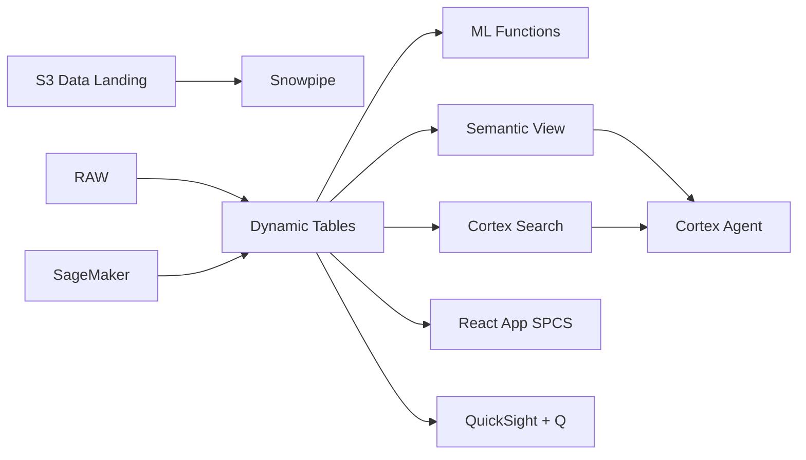

# Upstream Exploration Analytics

Data-driven exploration for Malaysia's offshore basins — ML.FORECAST projects production curves, Iceberg enables JV partner access, and Cortex Agent answers subsurface questions.

## Architecture

Malaysia's offshore basins produce 600,000 barrels per day across hundreds of wells operated under Production Sharing Contracts with PETRONAS. A VP Exploration needs to rank prospects, forecast decline curves, and share data with JV partners — but subsurface intelligence is trapped in PDFs, production data sits in siloed systems, and partner reporting requires manual extracts.



## Snowflake Capabilities

| Capability | Implementation |
|-----------|---------------|
| Dynamic Tables | WELL_PERFORMANCE_SUMMARY / PRODUCTION_TIMESERIES / BLOCK_ECONOMICS / RESERVES_MOVEMENT |
| ML Functions | ML.FORECAST |
| Cortex AI | SUMMARIZE, AI_CLASSIFY |
| Cortex Search | 120 documents indexed |
| Cortex Agent | EXPLORATION_INTELLIGENCE_AGENT |
| Semantic View | EXPLORATION_ANALYTICS |
| React App (SPCS) | 5 tabs + DemoGuide |


## AWS Services

| Service | Role in Demo |
|---------|-------------|
| Amazon S3 | Store seismic data files (SEG-Y) and well logs (LAS) |
| Amazon SageMaker | Geophysical ML models for seismic inversion and AVO analysis |
| Apache Iceberg (S3) | Open table format for JV partner governed data access |
| AWS Glue | Catalog and ETL for seismic and production data |
| Amazon Athena | Ad-hoc querying of Iceberg tables by JV partners |
| Amazon QuickSight + Q | Executive exploration dashboard with natural language |


## Personas

| Persona | Role | Key Questions |
|---------|------|---------------|
| **Dr. Kamal bin Mohamad** | VP Exploration | "Which prospects exceed our economic threshold?" "What's the reserves replacement ratio this year?" |
| **Sarah Tan Wei Ling** | Geologist | "What does the subsurface report say about Prospect Alpha?" "Show me the production decline curve for Well MY-047" |


## Data

| Table | Rows | Description |
|-------|------|-------------|
| WELLS | 200 | Exploration and production wells across 8 offshore blocks |
| SEISMIC_SURVEYS | 50 | 2D/3D seismic survey metadata and interpretation results |
| PRODUCTION_LOGS | 100,000 | Daily production logs (oil, gas, water) for all active wells |
| RESERVES | 500 | Proved, probable, and possible reserves estimates by block |
| EXPLORATION_DOCS | 120 | Subsurface reports, well proposals, geological assessments, PSC summaries |
| MALAYSIA_OG_MACRO | 10 | Malaysia O&G production context and Brent/Tapis pricing |


## Build Instructions

### Prerequisites
- Snowflake account with ACCOUNTADMIN access
- Cortex AI enabled (ML Functions, Search, Agent)
- Warehouse: OG_EXPLORE_WH (Medium)
- AWS CLI with access (us-west-2)

### Deployment

```bash
snowsql -f snowflake/00_setup.sql
snowsql -f snowflake/01_marketplace_install.sql
snowsql -f snowflake/02_raw_tables.sql
snowsql -f snowflake/03_staging.sql
snowsql -f snowflake/04_dynamic_tables.sql
snowsql -f snowflake/05_search.sql
snowsql -f snowflake/06_ml_models.sql
snowsql -f snowflake/07_semantic_view.sql
snowsql -f snowflake/08_agent.sql
```

### React App (SPCS)
```bash
cd app && npm ci && npm run build
docker build -t aws-malaysia-oil-gas-exploration-app .
docker push bdiqc8sm-default.registry.snowflakecomputing.com/oil_gas_exploration/app/aws_malaysia_oil_gas_exploration/app:latest
```

### Demo Mode
Open the app URL with `?demo=true` for presenter view.

## Build Modes

### Snowflake Only
Run scripts 00-08 (skip AWS-specific integration). Uses:
- **Snowflake Stages + External Volume** instead of Amazon S3
- **ML.FORECAST (production decline curves)** instead of Amazon SageMaker
- **Iceberg Tables (native)** instead of Apache Iceberg (S3)
- **Dynamic Tables + Snowflake Catalog** instead of AWS Glue
- **Snowflake Reader Accounts / Secure Sharing** instead of Amazon Athena
- **Snowflake Intelligence (Cortex Analyst)** instead of Amazon QuickSight + Q

### Full AWS + Snowflake
Run all scripts including AWS integration. Deploy QuickSight dashboard from `quicksight/`.

## Business Impact

Industry research and Snowflake customer outcomes:
- **Malaysia produced 594,000 bbl/d of crude oil and 83.5 Bcm of natural gas in 2023** — [EIA](https://www.eia.gov/international/analysis/country/MYS)
- **PETRONAS reported RM 282.7B revenue in 2023 with upstream as the largest contributor** — [PETRONAS Annual Report](https://www.petronas.com/media/reports)
- **AI-enabled reservoir management can increase recovery by 5-8% per field** — [McKinsey Energy](https://www.mckinsey.com/industries/oil-and-gas/our-insights)
- **Snowflake enables real-time data sharing across energy joint ventures** — [Snowflake Energy](https://www.snowflake.com/en/data-cloud/energy/)


## Key Demo Numbers

- **200 wells** across 8 offshore blocks in Malay and Sarawak Basins
- **RM 4.2B** annual production revenue
- **3 prospects** above economic threshold (NPV > RM 800M)
- **120 subsurface docs** indexed and searchable via Cortex Search
- **100K production logs** daily readings across all active wells
- **18% decline rate** accelerated decline in Block PM-3 wells
- **4 wells** flagged for workover due to high water cut


## License

Apache 2.0 — See [LICENSE](LICENSE) for details.

This is a personal demo project and is not an official Snowflake offering. It comes with no support or warranty.